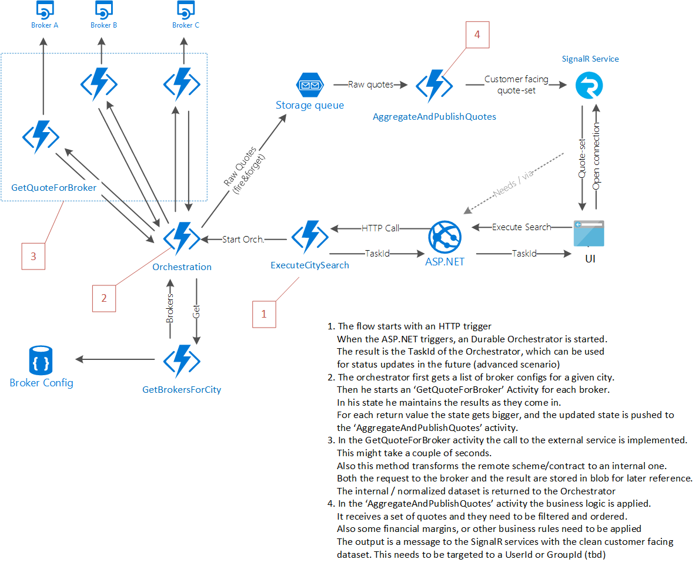

# Realtime-Quotes-Example
An example implementation for real time quotes with Azure Functions and SignalR.

## Scenario
Contoso.com is a platform for booking the best tour-guides in every city. On their website you type a name of a city and the Contoso.com platform will find the best offers.

What happens behind the scene's is that Consoso has integrations with local offices, called 'suppliers'. Each supplier has an API.

This example solutions focusses on how the search results ('quotes') can be shown incrementally.

This is important because some suppliers have a slow api. Therfor, when the first quotes arrive, they need to be pushed to the end-user near-realtime.

The reason Contoso is so succesful, is their business logic. Contoso applies business logic on these quotes. They sort in a smart way so that the best price/quality results end up on the top of the list. Also they add some margin to the quotes, they need to make some money after all.

## Non-Functional requirements:
* PaaS only, 'serverless' preferred
* No polling
* Linear scalable: start small and cheap, scale to millions
* Reliable performance

## The solution

* An ASP.NET based web application, with a Javascript based front-end
* [Azure SignalR](https://azure.microsoft.com/nl-nl/services/signalr-service/) for the open connection and communication with the end-user's browser
* [Azure Durable Functions](https://github.com/Azure/azure-functions-durable-extension) for the Backend work

## Architectural overview

1. The flow starts with a [HTTP trigger](./Functions/HttpTrigger.cs), triggered by the [ASP.NET application](./Frontend/QuotesHub.cs#L17-L25) when someone enters a search query in [the UI](https://github.com/keesschollaart81/Realtime-Quotes-Example/blob/master/Frontend/Pages/Index.cshtml). Then a Durable Orchestrator is started and the TaskId of the Orchestrator is returned to the ASP.NET Application. This TaskId can be used for later referance (or status updates in the future, advanced scenario)

2. [The orchestrator](./Functions/Orchestration.cs) first gets a list of supplier configs for a given city (using an activity). Then he starts a '[GetQuoteForSupplier](./Functions/Orchestration.cs#L28-L38)' Activity for each supplier (varying from 3- 20). In his state, the Orchestrator gathers the results as they come in. For each return value the state gets bigger, and the updated state is pushed to the '[AggregateAndPublishQuotes](./Functions/Orchestration.cs#L28-L38)’ activity.

3. In the '[GetQuoteForSupplier](./Functions/GetQuoteForSupplier.cs)' activity, the call to the external service is implemented. This might take a couple of seconds (or even fail). This '[GetQuoteForSupplier](./Functions/GetQuoteForSupplier.cs)' activity also transforms the supliers scheme/contract to an internal one. Both the request to the supplier and the result can stored in blob for later reference. The internal / normalized dataset is returned to the Orchestrator.

4. In the '[AggregateAndPublishQuotes](./Functions/AggregateAndPublishQuotes.cs)’ activity, the business logic is applied. It receives a set of quotes which needs to be filtered and ordered. Also some financial margins, or other business rules need to be applied. The output is a message to the SignalR services with the clean, customer facing, result. This needs to be targeted to a UserId or GroupId (tbd)